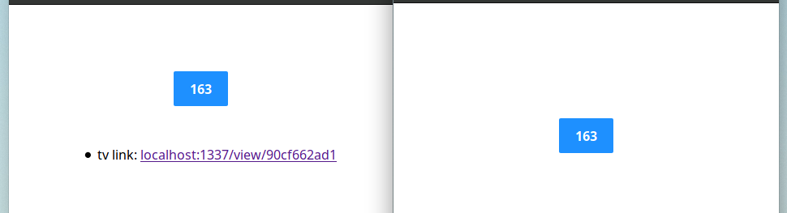

# Button clicker

A clicker button, that streams!

## Introduction

Using Server Sent Events (SSE), vanilla javascript and an express server,
I created a simple app, where a user clicks a button and streams it through SSE.

Basically every time you click the button on the main page (`/`), its
value is incremented by 1. This event is then sent to the server for
eventual propagation. Using an `EventEmitter` _N_ listeners can subscribe
to this unique session and reacting to it. When opening a subscription
window, the button value should evolve together with the main page.

What's magical here (at least for me), is the use of basic HTTP
headers to create a `keep-alive` session that allow SSEs. The same goes
for the clientside javascript, only using `EventSource` it's possible
to create a reactive client-side app without all the burder of
websockets!

This project is born from multiple sources of inspiration.
First a fantastic [talk][u:talk] I saw at MiXiT
Lyon in 2017 by Audrey Neuveu (in French).
Then, my desire to learn more about raw HTTP and its brilliant
headers.
Thirdly, a great [article][u:article] explaining how to do SSEs in
nodejs by Tom Kernsten.
And finally, just the fun of making a "reactive" app out of nearly
bare nodejs.

[u:talk]: https://mixitconf.org/2017/le-streaming-d-api-pourquoi-et-comment-transformer-vos-apis-statiques-en-donnees-temps-reel-
[u:article]: https://tomkersten.com/articles/server-sent-events-with-node/

## Pages

### `/`

The main page, where a session is started, to register the click.

### `/view/:sessionid`

The "tv" page, where one can follow the activity of a precise session

## REST endpoints

## GET `/session`

Create a new session and returns it.

## GET `/sessions/:id`

Retrieves the current state of the session

## PUT `/sessions/:id/click`

Increment the `clicks` value of the session by one.

## GET `/sessions/:id/stream`

Open the SSE session.
